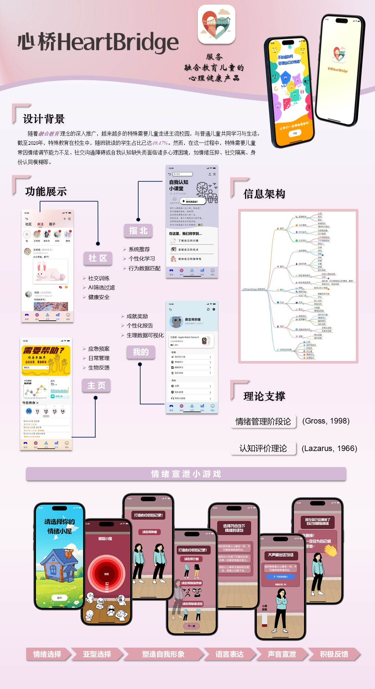
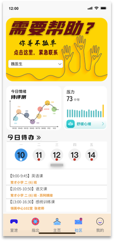
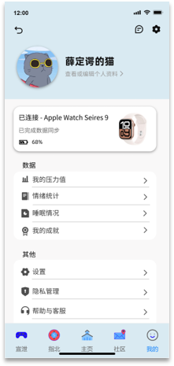
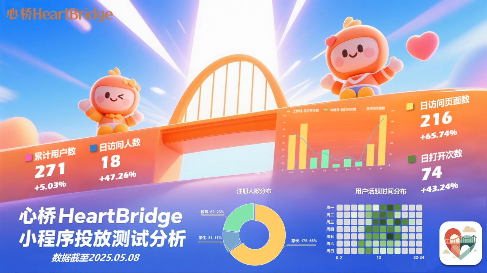

# HeartBridge: A Mental Health App for Children in Inclusive Education

Hello everyone, and welcome to this poster! Here, I'm excited to share a project that's very close to my heart: "HeartBridge," a mental health app designed to support <strong>children with special needs in inclusive education</strong> environments.

## The Challenge: Supporting Every Child's Mental Wellbeing

The philosophy of inclusive education, which brings children with special needs into mainstream classrooms, is gaining momentum. While this is a positive step towards a more equitable society, it also presents unique challenges. Children with special needs often face psychological difficulties such as emotional distress, social isolation, and a developing sense of self. If left unaddressed, these challenges can negatively impact their learning, social experiences, and long-term mental health.

## Our Solution: The HeartBridge App

To address this gap, we developed "HeartBridge," a smart, digital mental health platform for children with special needs in inclusive education settings. The app's core mission is to empower these children by helping them recognize, accept, and express their emotions, thereby building psychological resilience and fostering better integration into school and society.

"HeartBridge" leverages AI and biofeedback technology to provide real-time emotional monitoring, risk alerts, and personalized interventions. The app is built around five core modules:

  
  
  
  

**Homepage:** This central dashboard displays real-time emotional trends using biofeedback data and AI-powered predictions. It provides crucial data for both daily management and emergency situations. It also includes an emergency plan feature with a quick-dial function to contact parents, teachers, or doctors in a crisis.

<strong>Release:</strong> This section features interactive games designed to help children identify and release stress and negative emotions in a healthy way.

<strong>Guide:</strong> Powered by a large language model trained on special education and counseling resources, this module offers learning support and emotional guidance. An AI-powered recommendation system also suggests personalized courses on emotional management and self-awareness.

<strong>Community:</strong> We've created a safe and positive social space for children to interact. AI algorithms filter content and match users to facilitate supportive and meaningful connections.

<strong>My Profile:</strong> Here, both physiological and psychological data are visualized in personalized reports. This allows parents and educators to stay informed about a child's wellbeing in real-time.

## Grounded in Psychological Theory

The design of "HeartBridge" is not just technologically advanced; it's also rooted in established psychological theories. We've incorporated concepts like the <strong>process model of emotion regulation</strong> (Gross, 1998) and theories of <strong>embedded emotional regulation</strong> to create a scientifically-grounded tool for emotional development. This ensures that our approach to emotional expression and feedback is both effective and supportive.

## The HeartBridge Business Model

Our go-to-market strategy is multi-faceted, focusing on three key channels: school partnerships, government procurement, and direct engagement with families. By collaborating with educational institutions and leveraging policy support for inclusive education, we aim to establish a strong user base within schools. We also plan to work closely with psychology and special education experts to enhance the app's credibility and professional impact. For families, we will use social media and parent communities to share valuable content about child psychology and emotional management, encouraging organic adoption.

## User Feedback and The Road Ahead

Initial testing of our prototype has been very promising. Data from our beta launch shows a cumulative user base of 271, with teachers making up the largest segment of registered users. The daily user engagement and page views have shown significant positive trends.

This project has been a rewarding journey, combining my passion for psychology, technology, and education. I believe that with tools like "HeartBridge", we can build a more inclusive and emotionally supportive world for every child.

Thank you for reading!