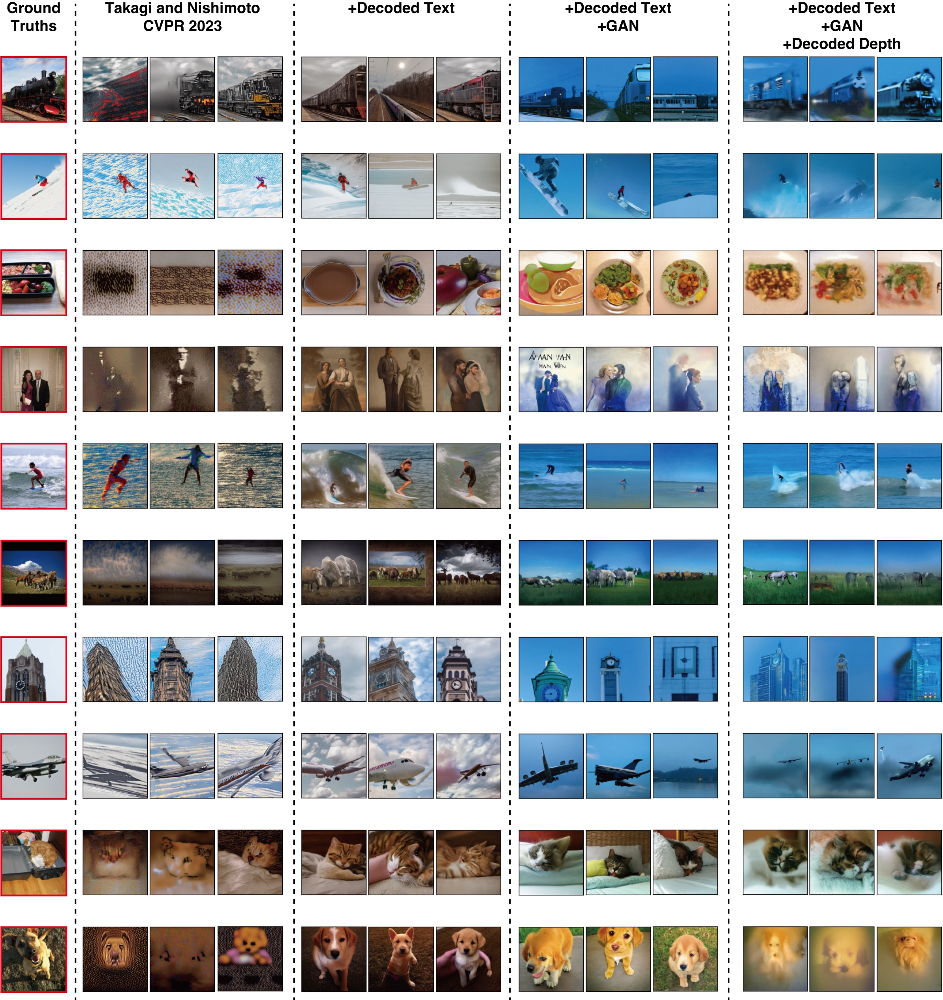
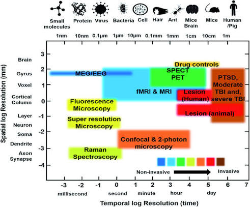

# How We Gamble with Neural Models and Multimodal Technologies? Personal Insights

I am very willing to share some thoughts and insights around newly published research on neural models and related technology. Generally, this involves fields in multimodal transfer prediction, neural data prediction, real world prediction, and the ambition of foundation models which contain all modalities. These comments reflect some of the most popular trends nowadays in both industry and research institutions. As a research student stepping into computational modeling, I want to present this as a personal monologue on where the field is placing its bets.

## Multimodal Transfer Prediction: A High Investment Gamble

Many researchers are gambling heavily on cross neural modality prediction, but I want to critique this direction directly. Frankly, it lacks real application scenarios.

<figcaption>Takagi, Y., & Nishimoto, S. (2023). High-resolution image reconstruction with latent diffusion models from human brain activity. In <em>Proceedings of the IEEE/CVF Conference on Computer Vision and Pattern Recognition</em> (pp. 14453–14463).</figcaption>

Some argue this technology is useful for research convenience. The idea is to use an easy-to-get recording method to predict a much harder to test method. But to actually replace the complex method in a clinical or research setting, the model requires extremely high accuracy. It basically needs one hundred percent accuracy to be trusted (not joking). Achieving that level of perfection is almost impossible in cross modal research. Without it, the technology cannot truly replace actual physical testing.

Furthermore, betting on this direction is a massive gamble because it is a high investment and low return idea. To train these models, we need massive amounts of simultaneous data collected from different devices at the exact same time. This simultaneous collection is severely restricted by current hardware limits and equipment interference. Getting the data is just the first massive hurdle, and that does not even guarantee the model will learn anything useful from it.

## Neural Data Prediction: Mechanism or Curve Fitting

The second trend is neural data prediction, where models predict how the brain will respond to specific inputs. Researchers invest huge computing power here, but we have to ask if this gamble actually helps us understand the brain.

Artificial models process data very differently from biological neural cells. If we train a deep network to predict a brain wave, we might just be doing high dimensional curve fitting (based on different reward mechanisms, models know how to mimic a line dancing). We are essentially using one black box to explain another black box. Even if the prediction accuracy is high, it does not mean the model has learned the actual cognitive mechanism behind the scenes. Without revealing a clear biological mechanism, this technology remains a statistical trick rather than a true scientific insight.

## Reconstruction of Real-World Stimuli: Storytelling or Reality?

Reconstruction of real-world stimuli from neural data is another massive trend. Just for a fast look at real world prediction, it is fascinating that a model could predict specific real-world stimuli according to the neural data, no matter what type of neural data it is.

To understand this, we have to look at the devices. Some devices are good at spatial detection, such as fMRI, iEEG, and ECoG. They capture the specific signal which reflects the activities in a specific area, a specific layer, or even specific sets of neurons. But they have limitations. It is hard to get the immediate reaction of neural cells with fMRI. It is also difficult to do behavioral experiments at the same time with iEEG and ECoG, even if you just input a simple visual stimulus without an action. On the other hand, some technology helps us capture the immediate spike activities in neural cells, such as EEG and ERP. This is pretty helpful in cognitive research because it can highly relate the input real world stimulus with specific neural activities.

<figcaption>Prasad, A., Chaichi, A., Kelley, D. P., Francis, J., & Gartia, M. R. (2019). Current and future functional imaging techniques for post-traumatic stress disorder. <em>RSC Advances</em>, 9(42), 24568–24594.</figcaption>

The core of such detection is based upon the fact that our neural activity in a normal state is relatively stable. It does not mean we can totally figure out which part of the spike or wave is for the normal state, and which is due to the input stimulus. Actually, the simple activity in our brain is mostly noisy and unexplainable. But all the noise here could be seen as the same on average, with the fact that these activities represent some basic information without sensory input. So, the reason that we can use brain waves to explain some behavioral phenomenon is that we just focus on the most specific change in these waves, and average or even ignore the other active neural data statistically.

With these significant spikes, which actually ignore the other unknown brain activities, how can we predict the related stimulus from just one part of neural data? Today, some models declare that they can reconstruct the real world input from the neural data. To be honest, this makes for great storytelling, but it is hard to figure out whether it is actually possible just from the brain data. Because they are based on large scale datasets and AI models, they definitely have better performance on data reading and learning than human experts. But has the progress of models reached the level that they can at least partly reconstruct the input stimulus just using the neural data collected at the same time?

I have to point out that these models typically have two paths. One path is for word segmentation, which actually helps a lot, and another path is from the pure neural data. So what is the actual function of the neural data here? Does it actually work? Or does the reconstruction highly depend on the text from the segmentation? As we mentioned before, the so called noise is from unexplainable brain activity. Letting an image generator hallucinate a picture from a text label is not the same as true brain reading.

## Foundation Models: The Barrier of Individual Biology

Finally, there is the ambition to build foundation models that contain all modalities. This is perhaps the biggest gamble of all. The idea is to have one massive model handle everything. But neural data has an extreme individual variability barrier. Every person has a different brain structure, different cognitive habits, and unique neural pathways. A foundation model would need to generalize perfectly across different people and different equipment setups. Without solving this biological difference, a universal model is just a theoretical illusion rather than a practical tool.

## Conclusion

Ultimately, these comments are just my personal insights and an inner monologue. I take no formal responsibility for them, and as a research student, I know my perspective is very minor. The field moves fast, and my views may change even a few months later as new research is published and I learn about better models and workflows. I just hope to see better work and models emerge from the genuine development of human technology :)

